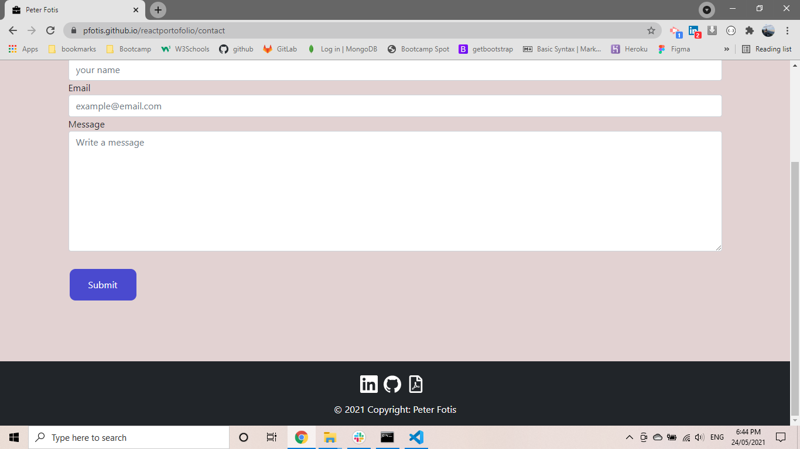

# react-portofolio

* [links](#links)
* [Description](#description)
* [Built With](#builtwith)
* [Installation](#installation)
* [Screenshots](#screenshots)
* [Questions](#questions)

## links

[Repository link](https://github.com/pfotis/reactportofolio)

[website link](https://pfotis.github.io/reactportofolio/)

## Description

    As full stack developer i built my portofolio in the github to include my projects with links for
    the webpage and the repository for each individual project. Information about me , my study in the 
    bootcamp and the past and my Knowledgment in the coding. Finaly contact there are link of my github 
    account and my linkedin acount , my personal email and mobile number additional link to see my resume.

## Built With

    React.js
    HTML
    CSS
    Javascript

## Installation

    npx create-react-app react-portofolio
 

## Screenshots

    With the following pictures the user could see the outfit of this project.

## Questions

    For any questions about this repository, please contact me at pfotis@gmail.com
    View my work in GitHub pfotis(https://github.com/pfotis)